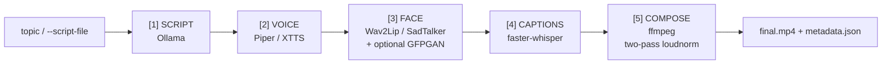

# Echoface

[](https://github.com/ninad-k/Echoface/actions/workflows/ci.yml)
[](LICENSE)
[](pyproject.toml)

**Local, fully offline AI avatar video pipeline.** Give it a topic, get
back a publish-ready 9:16 Short: `topic -> script (local LLM) -> voice
(local TTS) -> lip-synced talking face -> captioned video with music`.
No cloud APIs, no per-minute fees, no subscription — everything runs on
your own machine.

```
echoface make --topic "3 habits of disciplined traders" --presenter anchor1
```

## Why

Paid avatar-video services (HeyGen, Synthesia, ...) charge per minute and
require uploading your face/voice to their cloud. Echoface is a free,
local alternative for creators who want unlimited renders, full data
locality, and no vendor lock-in — see
[`docs/business/brd.md`](docs/business/brd.md) for the full rationale.

## Features

- **One command, full pipeline**: script generation (Ollama), text-to-speech
  (Piper or XTTS v2), lip-synced face animation (Wav2Lip or SadTalker, with
  optional GFPGAN or CodeFormer restoration — whole-face or mouth-only),
  word-level captions (faster-whisper), and ffmpeg-based 1080x1920
  assembly with music ducking and adaptive loudness normalisation.
- **Resumable, idempotent jobs** — `resume`/`clean` skip or invalidate
  exactly the stages that need it, tracked via per-stage config hashing.
- **Consent enforced in code, not just policy** — refuses to render a
  presenter without an on-file consent reference; `echoface presenter
  init <name>` scaffolds a new presenter folder with a consent checklist
  without weakening that gate.
- **Output retention** — `echoface prune --older-than 30d --keep-final`
  reclaims disk space from old job runs (dry-run by default; deletion
  needs an explicit `--delete`).
- **Licence-aware `doctor`** — cross-checks every active model against a
  machine-readable licence table (`models/licenses.yaml`) and warns on
  any non-commercial model when `monetized: true`.
- **Runs on modest hardware** — 4 GB VRAM baseline target, verified on an
  8 GB RTX 5070 Laptop GPU (Blackwell, CUDA 12.8+).
- **CPU-safe, GPU-free testing** — every heavy stage has a `dummy` engine
  so the full pipeline shape (including the real ffmpeg compose stage) is
  CI-testable without a GPU; a separate `gpu`/`ollama`-marked test tier
  (`tests/gpu/`, `scripts/run_gpu_tests.ps1`) exercises the real engines
  on tiny inputs when a GPU is available, optionally as an on-demand
  self-hosted CI run — see
  [`docs/ops/self-hosted-gpu-runner.md`](docs/ops/self-hosted-gpu-runner.md).
- **Automatic OOM handling** — halves batch size, then falls back to CPU.

## Quickstart

```powershell
git clone https://github.com/ninad-k/Echoface.git
cd Echoface
py -3.14 -m venv .venv
.venv\Scripts\pip install -e ".[dev,captions]"
.venv\Scripts\echoface doctor          # confirms what's set up / missing
powershell -ExecutionPolicy Bypass -File scripts\setup_windows.ps1  # heavy-model venvs + vendor repos
```

Then download model weights (see [`models/MODELS.md`](models/MODELS.md)
for exact official sources), add a presenter with written consent (see
[Responsible use](#responsible-use) below), and:

```powershell
.venv\Scripts\echoface make --topic "3 habits of disciplined traders" --presenter <name>
.venv\Scripts\echoface make --script-file my_script.txt --presenter <name>
.venv\Scripts\echoface batch --file topics.txt
.venv\Scripts\echoface resume <job-id>
.venv\Scripts\echoface clean <job-id> --from captions
.venv\Scripts\echoface presenter init <name>    # scaffold a new presenter folder
.venv\Scripts\echoface prune --older-than 30d --keep-final   # dry-run; add --delete to actually free space
```

Full step-by-step setup: [`docs/ops/installation-deployment.md`](docs/ops/installation-deployment.md).
Non-technical walkthrough: [`docs/user-manual.md`](docs/user-manual.md).

### Try it without a GPU

Every heavy stage has a `dummy` engine, so you can exercise the full
pipeline (including the real ffmpeg compose stage) with no GPU, no model
downloads:

```powershell
.venv\Scripts\echoface make --script-file tests\fixtures\sample_script.txt --presenter smoketest --config tests\fixtures\dummy.yaml
```

## Architecture



Each stage is idempotent and writes its artifacts to `output/<job-id>/`;
`resume` skips any stage whose config hash and outputs are unchanged. Full
architecture (C4 diagrams, ADRs, data flow, job state machine):
[`docs/architecture/software-architecture.md`](docs/architecture/software-architecture.md).

## Verified real-engine performance

Measured on an RTX 5070 Laptop GPU (8 GB VRAM), Python 3.14, torch
2.11+cu128, for a ~20s script — full detail and evidence in
[`docs/qa/test-plan.md`](docs/qa/test-plan.md) and
[`docs/ops/performance-vram-guide.md`](docs/ops/performance-vram-guide.md):

| Stage | Time |
|---|---|
| Script (Ollama qwen2.5:7b) | 6 – 17s |
| Voice (Piper) | 14 – 26s |
| Face (Wav2Lip + GFPGAN) | ~2 – 2.5 min |
| Face (SadTalker + inline GFPGAN enhancer) | ~4 min |
| Captions (faster-whisper) | 7 – 17s |
| Compose (incl. two-pass loudnorm) | 5 – 18s |

Final output: 1080x1920, H.264/AAC, integrated loudness within ±0.5 LU of
-14 LUFS and true peak ≤ -1 dBTP (both engines, measured directly with
`ffmpeg -af loudnorm=...:print_format=json`).

## Documentation

Full SDLC documentation, organised by role, lives in
[`docs/`](docs/README.md) — business requirements, architecture decision
records, test plans, a licence matrix, threat model, runbooks, and more.

## Responsible use

- **Written consent is required** before using any real person's face or
  voice — enforced in code (`echoface/job.py::check_presenter_consent`),
  not just policy. See [`docs/security/responsible-use-consent-policy.md`](docs/security/responsible-use-consent-policy.md).
- No public figures, no impersonation.
- Every render's `metadata.json` always includes an AI-disclosure line.
  Tick your platform's synthetic-content disclosure toggle at upload too
  — see [`docs/security/ai-disclosure-policy.md`](docs/security/ai-disclosure-policy.md).
- **Check model licences before monetising** — the default Wav2Lip
  checkpoint and CodeFormer restoration are research/non-commercial
  only; `echoface doctor` warns, against a machine-readable table
  (`models/licenses.yaml`), when `monetized: true` conflicts with any
  of your selected models. Full matrix:
  [`docs/security/license-matrix.md`](docs/security/license-matrix.md).

## Disclaimer

Echoface produces synthetic media. You are solely responsible for
obtaining consent, complying with each model's licence, and disclosing
synthetic content per your platform's policies and applicable law. This
project is provided under the MIT licence with no warranty — see
[`LICENSE`](LICENSE).

## Contributing

See [`CONTRIBUTING.md`](CONTRIBUTING.md). Security issues: see
[`SECURITY.md`](SECURITY.md).

## Licence

MIT (this repository's code) — see [`LICENSE`](LICENSE). Vendored models
and their weights carry their own, separate licences — see
[`docs/security/license-matrix.md`](docs/security/license-matrix.md).
