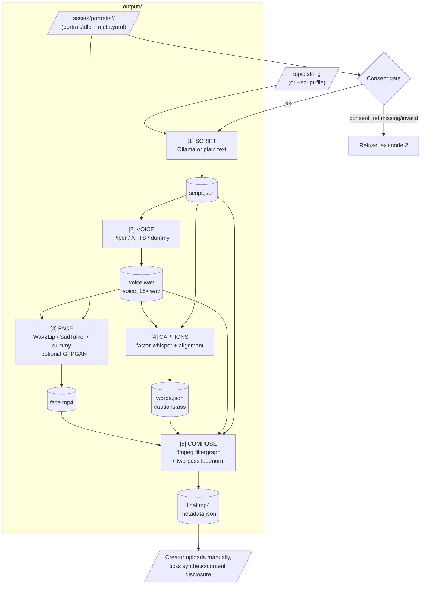

# Data Flow

## Per-stage inputs/outputs (as declared in code)

| Stage | `inputs()` | `outputs()` |
|---|---|---|
| script | `--script-file` (optional) | `script.json` |
| voice | `script.json` | `voice.wav`, `voice_16k.wav` |
| face | `voice_16k.wav` (+ presenter assets, not job-scoped) | `face.mp4` |
| captions | `voice.wav`, `script.json` | `words.json`, `captions.ass` |
| compose | `face.mp4`, `captions.ass`, `voice.wav`, `script.json` | `final.mp4`, `metadata.json` |

Every stage also implicitly depends on its own slice of `config/*.yaml`
(hashed — see `docs/architecture/adr/0005-idempotent-stage-hashing.md`)
and writes/reads through `job.json` for state tracking.

## Cross-cutting: `job.json` and `run.log`

`job.json` is written after every stage transition (started/done/failed)
and is the single source of truth `is_stage_done()` reads to decide
skip-vs-run. `run.log` accumulates every stage's rich-formatted log lines
plus the raw ffmpeg command lines the compose stage runs (via
`run_ffmpeg(..., log_path=job.run_log_path)`).
