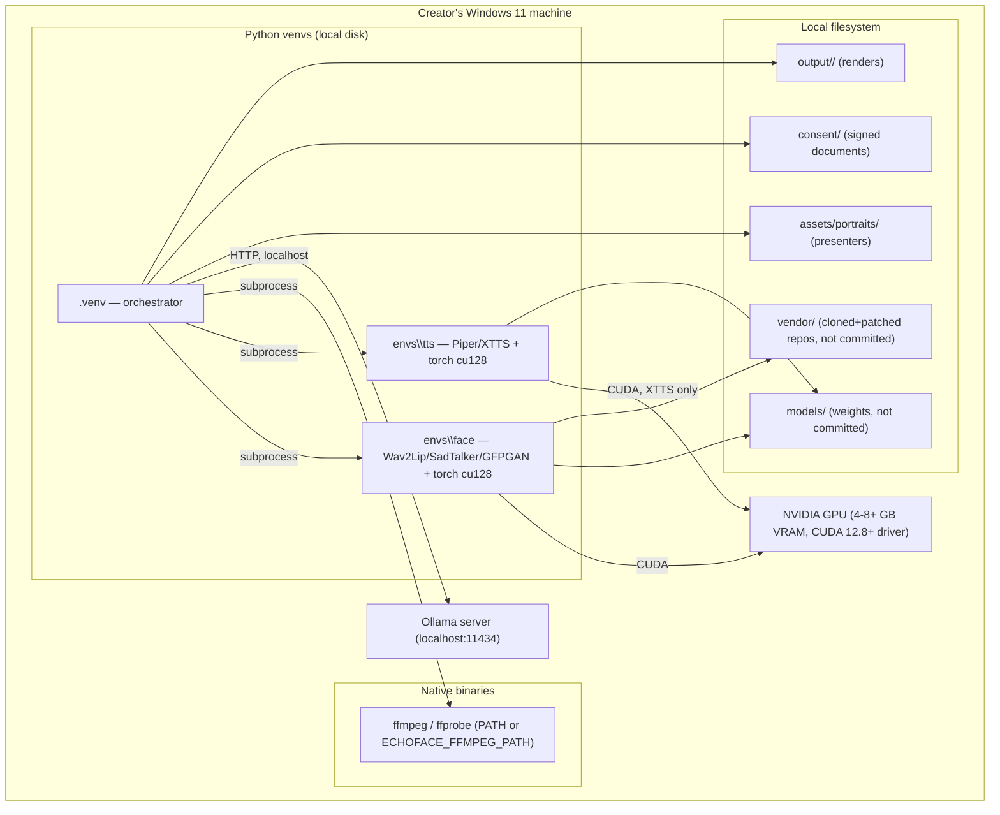

# Deployment View

Echoface is not deployed to a server — it is installed and run on a
single Windows machine the creator controls.

## Provisioning
`scripts/setup_windows.ps1` is the single entry point: creates all three
venvs, installs the correct CUDA wheel index, clones+patches the vendor
repos, and prints the remaining manual steps (model weight downloads,
adding a real presenter + consent, pulling an Ollama model). It is
idempotent — safe to re-run after a partial failure or to pick up new
dependency versions.

## CI deployment (for validation, not production)
GitHub Actions runners (`ubuntu-latest`, `windows-latest`) install only
the orchestrator venv + ffmpeg — no GPU, no `envs\face`/`envs\tts`, no
model weights. This validates orchestrator logic and the dummy-engine
pipeline shape; it does not and cannot validate real inference (see
`docs/architecture/adr/0007-dummy-engines.md`).

## No cloud/service deployment exists
There is no server component, no container image, no cloud deployment
target at v0.1.0. If a future local web UI (`docs/pm/roadmap.md`) is
built, it would still run entirely on the creator's own machine.
