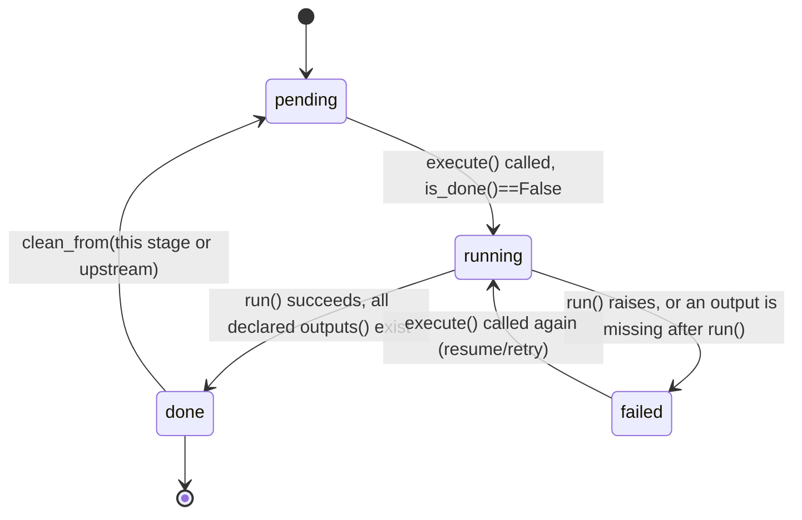
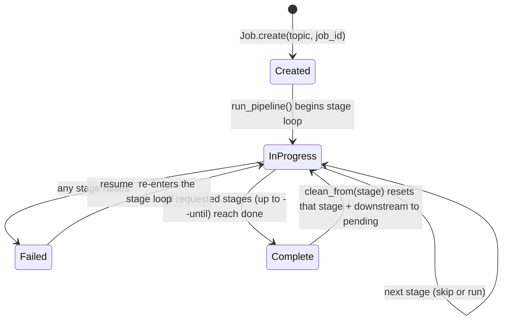

# Job / Stage State Machine

## Per-stage status

Recorded per stage in `job.json` (`echoface/job.py::StageStatus`):
`status` (`pending`/`running`/`done`/`failed`), `config_hash`,
`started_at`/`finished_at`, `duration_s`, `error`.

## Skip decision (`Job.is_stage_done`)

A stage is treated as already-complete (skipped by `execute()`) **iff
all** of:
1. Recorded `status == "done"`.
2. Recorded `config_hash` equals the stage's currently-computed hash
   (see ADR-0005) — so a config change invalidates the cache automatically.
3. Every path in `outputs()` still exists on disk.

Any of these being false forces a real re-run — this is deliberately
conservative (favours correctness over skip-aggressiveness): a deleted
output file, even with an unchanged hash, always re-runs.

## Job-level lifecycle

`Job.create(job_id=...)` is idempotent at the job level too: if a
`job.json` already exists at that path, it is **loaded** (preserving
every stage's recorded status) rather than overwritten — this was a real
bug found and fixed during development (see
`docs/qa/defect-log.md` DEF-3), because the naive "always write a fresh
job.json" behaviour silently discarded a completed ~2-minute GPU face
render on a repeat `make` invocation with the same `--job-id`.

## `clean --from <stage>`

`Job.clean_from(stage_name)` resets `stage_name` and every stage after it
in `STAGE_ORDER = [script, voice, face, captions, compose]` to a fresh
`StageStatus()` (status=pending, no hash), and the CLI layer
(`cli.py::clean`) deletes each reset stage's declared output files. Stages
*before* `stage_name` are untouched — their `done` status and files
survive, so a subsequent `resume` skips straight to the cleaned point.
