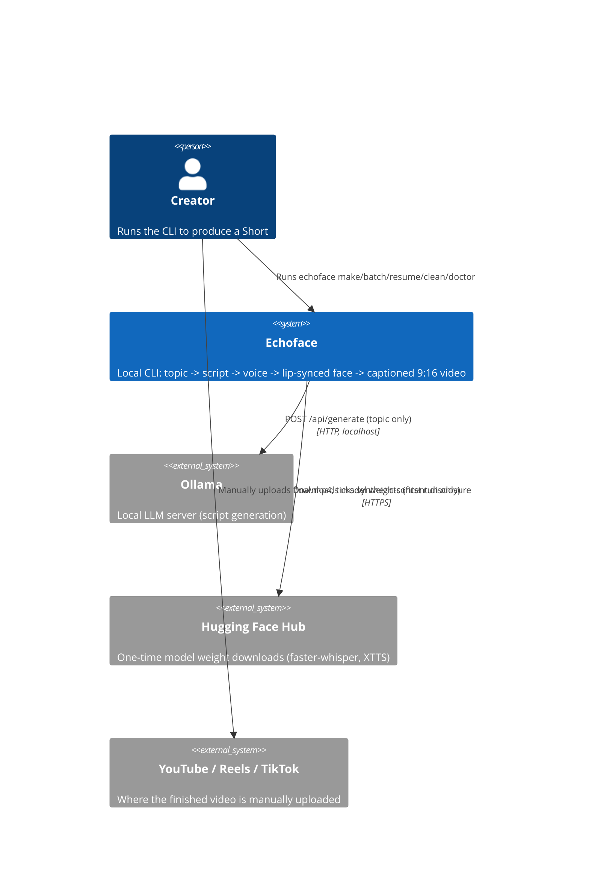
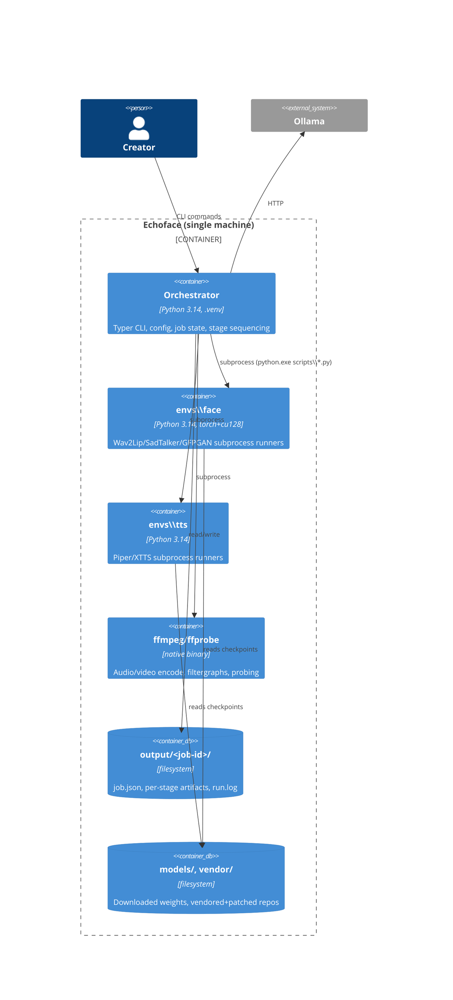
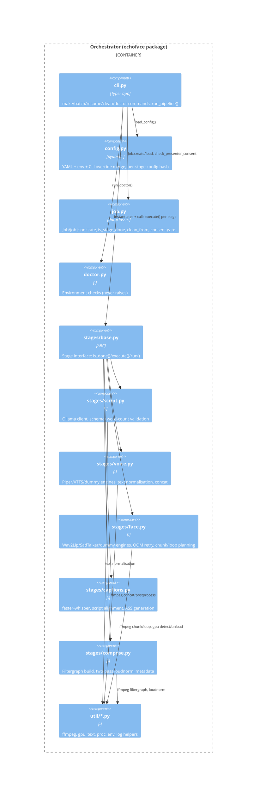

# Software Architecture (C4)

## Level 1: System Context

Echoface is a **local CLI**, not a service. It has no inbound network
interface. Its only outbound calls are to a local Ollama instance (script
stage) and, on first use of an engine, to Hugging Face Hub for model
weights — never carrying user media.

## Level 2: Containers

**Why separate venvs and subprocesses**: see
`docs/architecture/adr/0001-separate-venvs.md` and
`.../0002-subprocess-runners.md`.

## Level 3: Components (Orchestrator)

Every stage implements the same interface (`Stage` in `stages/base.py`):
`inputs()`, `outputs()`, `is_done()`, `run()`. `execute()` wraps `run()`
with timing, job-state updates, and skip logic — see
`docs/architecture/job-state-machine.md`.

## Data flow

See `docs/architecture/data-flow.md` for the artifact-by-artifact pipeline
diagram.

## Deployment view

See `docs/architecture/deployment-view.md`.

## Architecture Decision Records

See `docs/architecture/adr/` — one ADR per significant decision:

- [0001 — Separate venvs per heavy stage](adr/0001-separate-venvs.md)
- [0002 — Subprocess runner scripts, not in-process imports](adr/0002-subprocess-runners.md)
- [0003 — Python 3.14 + CUDA 12.8 (cu128)](adr/0003-python-3.14-cu128.md)
- [0004 — Two-pass loudnorm](adr/0004-two-pass-loudnorm.md)
- [0005 — Idempotent stage hashing](adr/0005-idempotent-stage-hashing.md)
- [0006 — Consent gate as a code-level check](adr/0006-consent-gate.md)
- [0007 — Dummy engines for GPU-free testing](adr/0007-dummy-engines.md)
